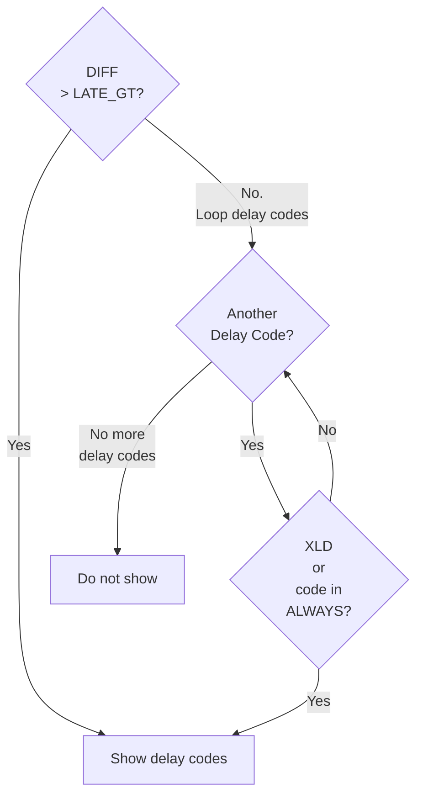

# PERFORMANCE

Performance report data web app.

Python 3
Flask
SQLAlchemy

# When delay codes show

DIFF is the number of minutes between estimated and actual times, calculated such that it is always positive. Then, if estimated time is greater than actual time, it is set to negative.

LATE_GT is a configured threshold number of minutes, defaulting to zero.

ALWAYS_SHOW_DELAY_CODES is a configured list of delay codes to show if DIFF threshold is not met. Abbreviated to ALWAYS below.

# INCIDENTS

* #16585 hide delays from report for config LATE_GT.
* #19499 an incident that became a place to put a flurry of reported errors.
